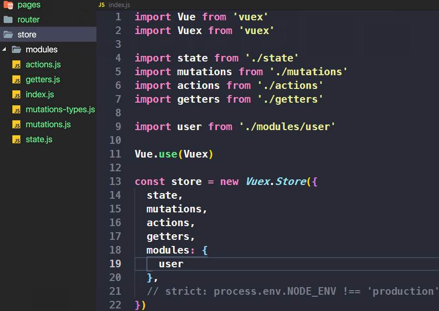
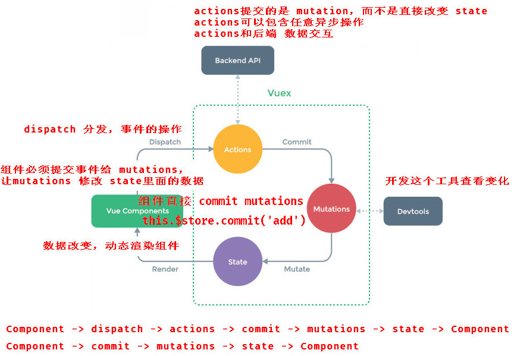
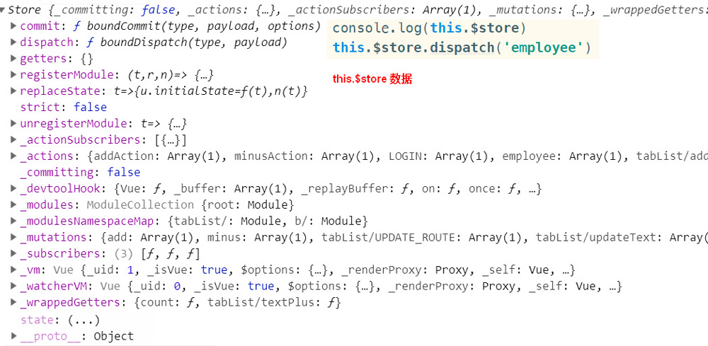
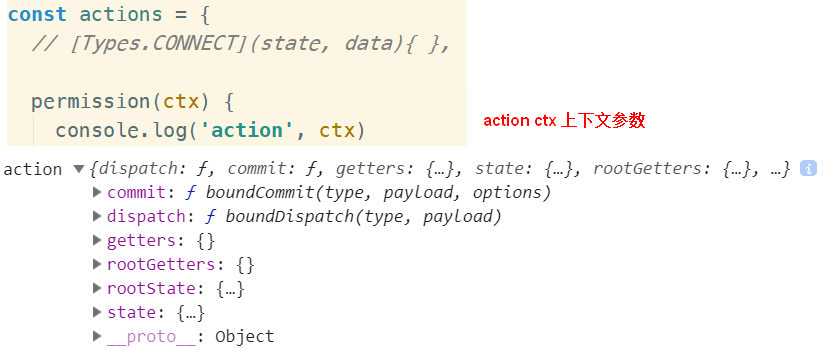
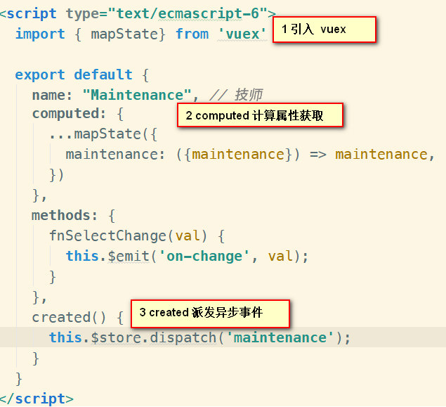
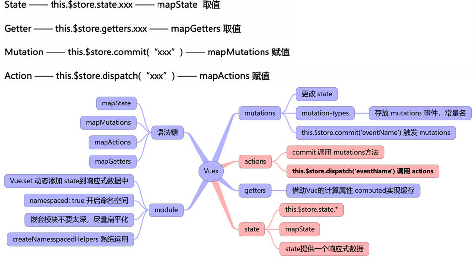

# Vuex 的用法


## 一 Vuex用法

1. 遵循单向数据流，只有 `mutations` 才能修改 `state`
2. `/store目录` 用来组织 vuex代码用的，将action，mutation，state分文件管理
  - store/index.js



[store/index.js](store/index.js ':include')


2. `main.js` 注册 `store/index.js`
  - vuex 结构类似 DOM，只有放在根实例 `new Vue()`上，下面的子节点才能拿到数据 `store`

```js
import Vue from 'vue'
import App from './App.vue'
import router from './router'
import store from './store'

new Vue({
  router,
  store,
  render: h => h(App)
}).$mount('#app')

```

3. `*.vue` 组件使用 vuex
  - `mapState, mapGetters` 是属性，放在 `data` 或 `computed`里面
  - `mapActions, mapMutations` 都是方法，放在 `methods`里面
  - commit 调用 mutations
  - dispatch 调用 actoins
  - 遵循单向数据流，只有 `mutations` 才能修改 `state`

[组件使用 vuex](vuex.vue ':include')

[组件使用 vuex](vuex.vue ':include')


## 三 Vuex是什么 

1. Vuex 为了大型项目数据状态管理
  - 状态就是公共的数据或属性，组件之间需要共享状态；
  - vuex借鉴了 flux, redux, vuex只能在 vue中使用，单独为 vue开发的
  - 解决了：EventBus 跨组件交互混乱（发布订阅），同名的会覆盖



2. Vuex 状态管理流程：
  - 遵循单向数据流，只有 `mutations` 才能修改 `state`
  - 不能让组件去直接改变数据，必须走一个流程


### [Vuex源码实现](3.vuex/vuex-core/vuex2)


### state.js

1. 组件里的公共数据，必须声明初始值，先声明后使用
  - state 里面事先要声明一个值，不声明会报错
  - 日常只要维护 actions mutations getters 就可以了
  - 获取 store的数据 `this.$store.state.属性名`

2. 修改 state唯一的方法是提交 mutation 




### mutations.js

1. 修改 state的数据，里面是方法，不能异步，只能同步
  - `mutations-types.js`，所有 mutations的常量

2. 组件可以直接 commit调用 mutations, mutations 修改 state里面的数据
  -  mutations 第一个固有参数是 state，接收的是 Vuex 中的 state 对象，第二个是要修改的数据
  - `mutations(state, data)`


### actions.js

1. 异步操作放在 actions里面，执行异步请求数据
2. actions不能修改 state
  - 组件 dispatch调用 actions，actions commit调用 mutations，mutations修改 state
  - actions不是必须品，如果有异步操作才用到 action，否则不可以使用
  - `this.$store.dispatch('getList')` 调用 action



3. actions参数是上下文的 context， context是 state的父级，包含 state、getters，可以用解构赋值来获取 state



```js
state

rootState

getters

rootGetters

commit()

dispatch()

```


### getters.js

1. getters的作用类似于 组件中的 computed，依赖 state的数据
  - 对 state里面的数据再加工，统一的计算，然后引用
  - `this.$store.getters` 获取 getters
  - getters 是方法，必须 return


### mutations和actions的区别

1. actions 是异步的，执行异步方法，主要和后台交互
  - actions 不能直接操作 state，需要commit调用 mutations来修改 store
  - 异步修改 ` components => dispatch => actions => commit => mutations => state => view `
  - ` this.$store.dispatch('xxx')`  调用 actions 中的函数
  - actions 中的函数传的是 context

2. actions 修改 state流程：
  1. 组件 dispatch 调用 actions中用 ajax请求获取到数据；
  2. 在actions中 commit调用mutations中的方法；
  3. 在mutations中，更新state；
  4. 路由组件获取新的state；
  5. 路由组件将更新后的数据，传递给子组件；
  6. 子组件渲染数据

3. mutations 直接修改 store
  - 同步修改 ` components => commit => mutations => state => view `
  - ` this.$store.commit('xxx')`  调用 mutations 中的函数
  - mutations 中的函数传的是 state


## 二 module模块

1. 将store分割成模块 `module`，每个模块拥有自己的 `state、mutation、action、getter`
  - moudle 也是一个 vuex，模块可以嵌套子模块

2. `namespaced: true` 开启命名空间
  - 模块嵌套不要太深，尽量扁平化
  - 灵活运用 `createNamespacedHelpers` 命名空间




### 模块动态注册

1. 用于项目接口数量很大，便于管理

https://vuex.vuejs.org/zh/guide/modules.html


## 三 plugins插件

1. 在 Store 初始化的时候可以进行函数调用，在 mutation 之后可以进行函数调用

### plugin 规范

[Vuex的插件的写法](store/plugins/plugins.js ':include')


### plugins 参数

```
  replaceState()

  watch()

  subscribe()

  registerModule()

  unregisterModule()

  hotUpdate()
```


## 四 Vuex持久化存储

1. 原理就是存在 localStorage里面，store数据刷新丢失，从新从localStorage获取
  - vuex 保存在内存中，刷新就会丢失，一般都会采用 cookie或者 localStorage

2. vue-persist Vuex持久化存储

```jsx
https://www.jianshu.com/p/7346a101332b

sessionStorage
https://www.cnblogs.com/goloving/p/9074574.html


vuex-persistedstate
	https://github.com/robinvdvleuten/vuex-persistedstate

vuex
	https://github.com/canfoo/vue2.0-taopiaopiao/tree/master/src/store
	https://github.com/hzzly/xyy-vue/tree/master/src/vuex/modules
	https://github.com/qidaizhe11/vue-vuex-typescript-demo/tree/master/src/store

React redux
	http://uprogrammer.cn/redux-in-chinese/docs/introduction/Motivation.html
```