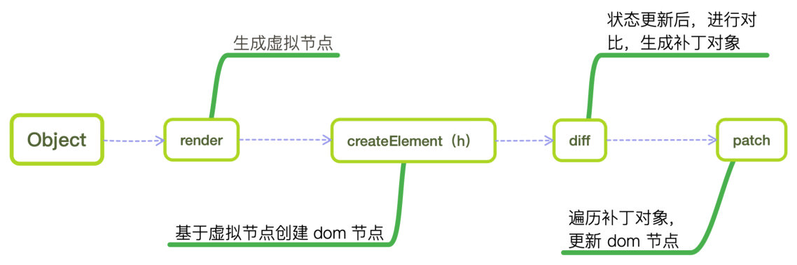

# Render函数和 Functional Render

1. Vue组件，内容都是写在 `<template>` 内的，但这并不是最终呈现的内容，
template 只是一种对开发者友好的语法，能够一眼看到 DOM 节点，容易维护，在 Vue编译阶段，会解析为 Virtual DOM

2. 与 DOM 操作相比，Virtual DOM 是基于 JavaScript 计算的，所以开销会小很多。Virtual DOM 运行的过程：
	- vue.js 通过编译将 template 模板转换成渲染函数（render）；
	- 执行渲染函数就可以得到一个虚拟的节点；
	- 然后在对 model 进行操作的时候，会触发 Dep 中的 Watcher 对象； 
	- watcher 对象会调用相应的 update 来修改视图，这个过程主要是将新旧虚拟节点进行差异对比 diff，然后根据对比进行 DOM 操作来更新视图；



3. Virtual DOM 运行过程中主要涉及了几个概念：
	1. 渲染函数：主要是用来生成 virtual DOM
	2. VNode虚拟节点：是节点描述，可以代表一个真实的dom
		- 最终真实的 dom就是通过 createElement将VNode渲染成真实的dom的
	3. patch，patching算法：虚拟dom最核心的部分
		- VNode最终就是经过这个算法成为真实的dom的，这个过程是对比新旧节点之间的不同，
		- 然后根据对比结果找出需要更新的节点进行更新

4. Virtual DOM 简单的说就是一颗树，一颗以javaScript对象（VNode）作为基础的树，用对象的属性来描述节点，因此这个对象至少包含标签名（tag）、属性（attrs）、和 子元素对象（chuildren）
	- Virtual DOM 的最终目的是将虚拟的节点渲染到视图上，它主要做了两件事：
		1. 提供与真实DOM节点对应的虚拟节点VNode；
		2. 将虚拟节点VNode和旧虚拟节点(oldVNode)进行对比，然后更新视图；
	- Virtual DOM 本质上其实就是js 和 dom 之间的一个缓存，通过 patching 算法计算出真正需要更新的节点
	- 提升渲染的性能；dom操作的减少，可以避免更多的回流和重绘等，更加高效的提高性能

5. vue 推荐使用 template 来构建页面，但也是支持直接写 render渲染函数的


## Render函数

- Render 函数将 template 的内容改写成一个 JavaScript对象，返回的是一个 JS 对象，没有传统 DOM 的层级关系
- h 即 createElement，是 Render 函数的核心
- render函数内不能用 `v-`指令，写的全都是原生JS

- render函数只有 3 个参数：
	1. 渲染的元素或组件
	2. 属性
	3. 子节点

```js
export default {
	render: (h) => {
		// return h('div', {}, [])
		return h('div',
		{
			attrs: { id: 'box' },
			class: { container: true },
			style: { color: red }
		},
		[
			h('p', '列表一')
		])
	}
}

```

1. 要渲染的元素或组件，可以是一个 html 标签、组件选项或一个函数（不常用），该参数为必填项

```js
h('div')

import DatePicker from 'component/date-picker.vue'
h(DatePicker)

```

2. 对应属性的数据对象，可选参数
	- 比如组件的 props、元素的 class、绑定的事件、slot、自定义指令等
	- 用到时查阅就好，[Render函数参数](https://cn.vuejs.org/v2/guide/render-function.html#createElement-%E5%8F%82%E6%95%B0)

3. 子节点，可选参数
	- String 或 Array，同样是一个 h

```js
[
	'内容',
	h('p', '内容'),
	h(Component, {
	 	props: {
	  	someProp: 'foo'
	 	}
	})
]
```


### render约束

所有的组件树中，如果 vNode 是组件或含有组件的 slot，那么 vNode 必须唯一

Vue不允许使用两个相同的 slot

错误的语法，vnode不是唯一

```js
render: h => {
	return h('div', [
		this.$slots.default, // 节点不能重复
		this.$slots.default
	])
}

const childNode = h(Child)
render: h => {
	return h('div', [
		childNode, // 节点不能重复
		childNode
	])
}

```


### 重复渲染

重复渲染多个组件或元素，可以通过一个循环和工厂函数来解决

表格列 render select

```js
// 核心代码 map返回一个新数据
[
	this.arr.map(item => h('Option', {
		props: { value: item.value }
	}, item.title))
]

render: (h, {row, column ,index }) => {
	return h('Select', {
		props: { value: row.name },
		on: {
			'on-change': value => this.tbody[index].name = value
		}
	}, [ // 渲染子节点
		this.arr.map(item => h('Option', {
			props: { value: item.value }
		}, item.title))
	])
}

```


### slot组件

1. 对于含有组件的 slot，复用比较复杂，需要将 slot 的每个子节点都克隆一份
	- 在 Render 函数里创建了一个 cloneVNode 的工厂函数，
	- 通过递归将 slot 所有子节点都克隆了一份，并对 VNode的关键属性也进行了复制

2. 深度克隆 slot 并非 Vue.js 内置方法，如 iView 组件库的穿梭框组件 Transfer
	- 通过克隆 VNode 的方法，显示了两遍，如果不这样做，就要声明两个具名 slot
	- 但左右两个的逻辑可能是完全一样的，使用者就要写两个一模一样的 slot，这代码可不好

3. [render函数进阶用法](https://cn.vuejs.org/v2/guide/render-function.html)，比如 v-model 的用法、事件和修饰符、slot 等

```js
render: (h) => {
	function cloneVNode (vnode) {
		let { tag, data, children,
			text, elm, isComment, componentOptions, context, ns, key, isStatic } = vnode
		// 递归遍历所有子节点，并克隆
		const clonedChildren = children && children.map(vnode => cloneVNode(vnode))
		const cloned = h(tag, data, clonedChildren)

		cloned.text = text
		cloned.isComment = isComment
		cloned.componentOptions = componentOptions
		cloned.elm = elm
		cloned.context = context
		cloned.ns = ns
		cloned.isStatic = isStatic
		cloned.key = key
		return cloned
	}

	const vNodes = this.$slots.default === undefined ? [] : this.$slots.default
	const clonedVNodes = this.$slots.default === undefined
		? [] : vNodes.map(vnode => cloneVNode(vnode))

	return h('div', [
		vNodes,
		clonedVNodes
	])
}
```


### render应用场景

1. 使用两个相同 slot。在 template 中，Vue不允许使用两个相同的 slot

2. 在 SSR 环境（服务端渲染），如果不是常规的 template 写法，比如通过 Vue.extend 和 new Vue 构造来生成的组件实例，是编译不过的

3. 在 runtime 版本的 Vue.js 中，使用 Vue.extend 手动构造一个实例，使用 template 选项是会报错的
	- 考虑兼容 runtime 版本和 SSR 环境的

4. props 传递父级数据是个**复杂的HTML结构字符串**
	- 解析正常的 html 节点且有 XSS风险
	- 需要最大化程度自定义显示内容时，就需要 Render 函数，可以渲染一个完整的 Vue.js 组件


## 参考资料

[Render函数参数](https://cn.vuejs.org/v2/guide/render-function.html#createElement-%E5%8F%82%E6%95%B0)

[Vue渲染函数和JSX](https://cn.vuejs.org/v2/guide/render-function.html)
