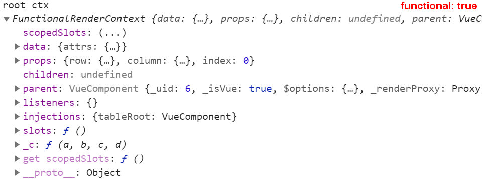
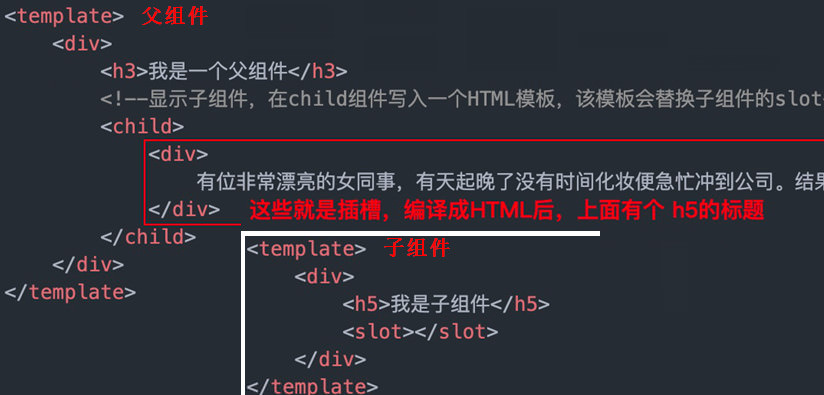
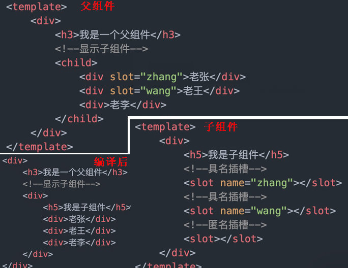
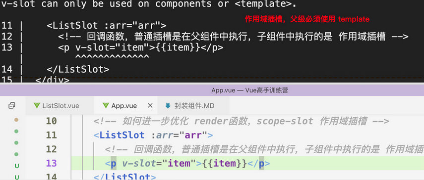
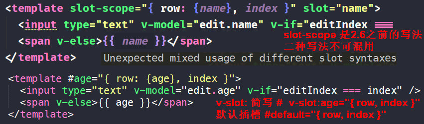

# 组件设计思路

1. 再复杂的组件，都由三部分组成的：`prop & event & slot`
  - 开发组件，一定要事先设计好这三部分
  - 用户都希望不断新增功能，修复 bug，而不是经常变更接口
  - `v-bind={}` 绑定一个对象，代替组件上的多个 props设置 
  - [编写Vue.js组件前需要知道的7件事](https://time.geekbang.org/column/article/109240)

2. 组件的核心功能也都是 ` prop ` 来确定的；` prop ` 定义了这个组件有哪些可配置的属性，最好用对象的写法，可以针对每个属性设置
  - `type` 参数类型，Vue对 prop值进行类型检查
  - `default` 默认值
  - `required` 是否必填项
  - `validator` 自定义校验属性的值

3. 单项数据流；子组件不能修改父组件的数据
  - 非要修改，在data 中拷贝一份数据，修改data的数据，让组件编程非受控组件
  - 好处：能够获取原始值，修改局部数据不会改变 prop的值

```js
export default {
  props: {
    number: {
      type: Number, // Vue对 prop值进行类型检查
      required: true, // 必须传递的参数
      validator(value) {
        return value.length > 5; // 参数校验
      }
    }
  },
  data(){
    return {
      num: this.number
    }
  }
}
```

4. html 原生的属性，在组件内的元素上会继承，比如 id、class
  - `inheritAttrs: false ` 禁用继承多余的属性
  - template 不能绑定 `:key="key"`
  - iview-ui 大量使用 `render函数`
  - element-ui 大量使用 `slot-scope`


## 一 template 模板封装缺陷

1. 模板的最大特点是扩展难度大，不易扩展。可能会造成逻辑冗余

```html
<Title :type="1">标题1</Title>
<Title :type="2">标题2</Title>
<Title :type="3">标题3</Title>

```

- Title组件需要对不同的 type产生不同的标签

```html
<template>
  <h1 v-if="type==1">
    <slot></slot>
  </h1>
  <h2 v-else-if="type==2">
    <slot></slot>
  </h2>
  <h3 v-else-if="type==3">
    <slot></slot>
  </h3>
</template>

<script>
export default {
  props: {
    type: {
      type: Number
    }
  }
}
</script>

```


## 二 functional函数式组件

1. 函数式组件没有模板,只允许提供 render函数
2. functional, render 的优势：复杂的逻辑变得非常简单
3. `functional: true` 函数式组件是没有 `this` 上下文的
  - 通过 h的第二个参数 context 来访问 prop、inject 

```javascript
export default {
  render(h) {
    return h("h" + this.type, {}, this.$slots.default)
  },
  props: {
    type: {
      type: Number
    }
  }
}

// functional: true
export default {
  functional: true,
  props: {
    row: {
      type: Object
    },
    column: {
      type: Object
    },
    index: {
      type: Number
    },
    render: {
      type: Function
    }
  },

  render: (h, ctx) => {
    // row 当前行数据；column 当前列；index 第几行；render传入的render函数
    let { row, column, index, render } = ctx.props
    return render(h, { row, column, index })
  }
}

```

- functional 的 context参数




### functional-jsx

- 使用jsx会让代码看起来更加简洁易于读取

```javascript
export default {
  props: {
    type: {
      type: Number
    }
  },
  render(h) {
    const tag = "h" + this.type
    return <tag>{this.$slots.default}</tag>
  }
}
```


## 三 render自定义渲染组件

1. render函数用法

```js
// 组件中的 render函数
export default {
  data () {},
  render (h) {
    return h('div', {}, [...])
  }
}

// h -> createElement Function 渲染标签
h('div', '渲染文本')

h('div', { class: 'box' }, '渲染文本')

h('div', {...}, ['渲染文本', h('span', '子组件')])

// h 渲染组件
import Buttom from 'component/Button'
h(Button, { props: {...}})

```

2. render 渲染函数比 template 更接近编译器

```js
  template
  ↓
  vue-loader + vue-template-compiler 预编译工具
  ↓
  render
  ↓
  resolve vnode

```

- 编写 List组件可以根据用户传入的数据自动循环列表
- 大多数能用 Render 函数的地方，都可以用 slot-scope 代替
  - slot-scope 相当于函数的回调函数，子组件给父组件返回结果

1. 父组件

```html
<template>
  <List :data="data"></List>
</template>

<script>
import List from "./components/List";
export default {
  data() {
    return { data: ["苹果", "香蕉", "橘子"] }
  },
  components: {
    List
  }
}
</script>

```

2. List 子组件渲染列表

```html
<template>
  <div class="list">
    <div v-for="(item,index) in data" :key="index">
      <li>{{item}}</li>
    </div>
  </div>
</template>

<script>
export default {
  props: {
    data: Array,
    default: () => []
  }
}
</script>

```


3. 通过 render方法来订制组件,在父组件中传入 render方法

```html
<template>
  <List :data="data" :render="render"></List>
</template>

export default {
  render(h, name) {
    return <span>{name}</span>
  }  
}

```


4. 我们需要createElement方法，就会想到可以编写个函数组件，将 createElement方法传递出来

```html
<template>
<div class="list">
  <div v-for="(item,index) in data" :key="index">
    <li v-if="!render">{{item}}</li>
    <!-- 将render方法传到函数组件中，将渲染项传入到组件中，
      在内部回调这个render方法 -->
    <ListItem v-else :item="item" :render="render"></ListItem>
  </div>
</div>
</template>

<script>
import ListItem from "./ListItem"
export default {
  components: {
    ListItem
  },
  props: {
    render: {
      type: Function
    },
    data: {
      type: Array,
      default: () => []
    }
  }
}
</script>

```

5. `ListItem.vue` 调用最外层的render方法，将createElement和当前项传递出来

```html
<script>
export default {
  props: {
    render: {
      type: Function
    },
    item: {
      type: [Number, String]
    }
  },
  render(h) {
    // 调用传递的 render方法和 item
    return this.render(h, this.item)
  }
}
</script>

```


## 四 JSX


[Vue中使用JSX的正确姿势](https://zhuanlan.zhihu.com/p/37920151)

[babel-plugin-transform-vue-jsx Github](https://github.com/vuejs/babel-plugin-transform-vue-jsx)


## 五 slot插槽

1. slot最核心的2点：显示不显示，怎样显示，是有父组件决定的
  - 怎么显示是有 父组件决定的
  - 插槽显示的位置是有 子组件决定的

2. slot就是子组件里的一个占位符，单个插槽和具名插槽不绑定数据




### 具名插槽

1. slot 插槽加了name属性，就变成了具名插槽，`<slot name="title">`
  - 默认插槽，没有 name属性，也叫匿名插槽

```jsx
// 匿名插槽
  <slot></slot>

// 具名插槽
  <slot name="title"></slot>

```




### slot-scope作用域插槽

1. 作用域插槽，带数据的插槽；作用域插槽要求，在slot上面绑定数据
  - 数据可以是 data，也可以是 props
  - 插槽最后显示不显示是看：父组件有没有在child下面写模板 `template`
  - 作用域插槽绑定了一套数据，父组件可以拿来用，本质上就是回调函数
  - 使用v-slot 将内部值传即可

2. vue2.6.0+，引入了 `v-slot`指令，取代了 `slot="name"`和 `slot-scope`
3. 没有指定插槽 name时，默认是 default `v-slot:default={}`，后面的花括号 {} 是解构赋值
  - ` <slot name="header" :header="header"></slot> `
  - ` v-slot `的缩写是 #，使用#的话，必须始终使用具名插槽来代替
  - ` <template #default="{item}"> `



- slot-scope 指定的参数 slotProps 就是这个 slot 的全部参数，是一个对象
  - slot-scope 中是可以传递多个参数的
  - 使用 ES6 的解构赋值

- [v-slot 参考文档](https://cn.vuejs.org/v2/api/#v-slot)

```html
<template slot-scope="slotProps"></template>

<template slot-scope="{ item, row }"></template>

```

- 具名插槽的用法
  - slot-scope 和 v-slot的语法不能混用



- 每一个 `<template>` 对应某一列的 slot-scope 模板
  - 配置的 slot 字段，指定具名的 slot-scope
  - Render函数中，用 $scopedSlots可以访问 slot-scope

- 定义的 slot-scope，初始时读取 `this.$refs.table.$scopedSlots` 是读不到的，会报错
  - 必须在 mounted 里赋值，才能获取到

```html
<template slot-scope="{ book }" slot="book"></template>

<template v-slot:book="{ item, row }"></template>

<template #book="{ item, row }"></template>

```


1. 父组件调用

```html
<template>
  <List :data="arr">
    <!-- template 的本质是个 回调函数, v-slot={} 里面的{} 是解构赋值
      v-slot:default 默认
      v-slot:item scope-slot 的 name='item' -->
    <template v-slot:default="{li:item, dataItem}">
      <p>{{item}} <mark>{{dataItem}}</mark></p>
    </template>
  </List>
</template>

<script>
import List from 'List'

export default {
  components: { List },
  data () {
    return {
      arr: [100, 200, 300]
    }
  }
}
</script>

```

2. 子组件封装 ` List.vue` 

```html
<template>
  <div>
    <template v-for="item of data">
      <!-- <slot :li="item" name="list" /> 具名插槽 -->
      <slot :li="item" :data-item="item * 3" />
    </template>
  </div>
</template>

export default {
  props: {
    data: {
      type: Array,
      default: () => []
    }
  }
}

```


## 六 实例化组件 
- extend 和 $mount经常一起使用

```js
Vue.extend

new Vue.extend().$mount

```


## 七 单元测试


## 八 发布组件