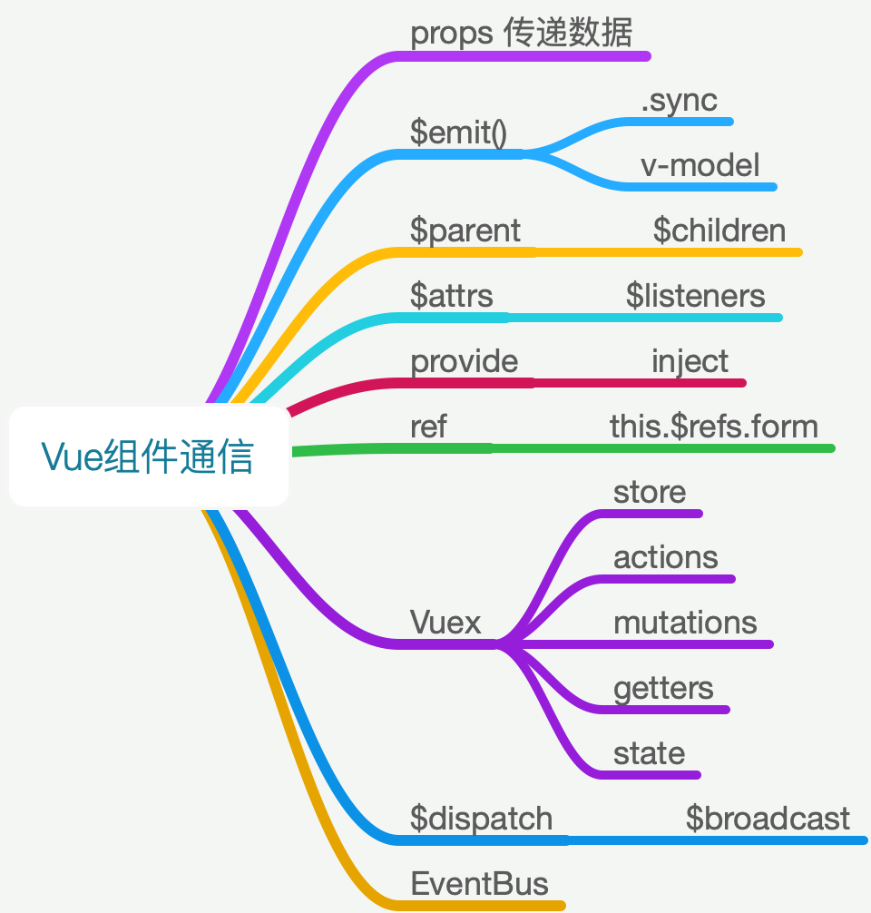
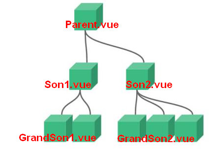

# Vue组件间 8 种通信方式

> 优先使用 Vuex <br>
> 其次 props & $emit <br>
> 再次 $parent, $children, Vue原型上挂载方法 $dispatch, $broadcast <br>
> 常用的还有 VueRouter 的 $router, $route 传值



|方式|类型|说明|
|:-|:-|:-|
| Vuex|| 全局数据管理|
| props|父子组件| validator数据验证 |
| $emit()|父子组件| v-mode, .sync |
| ref|ref="form" this.$refs['form'] | 写在标签上，获取的是 DOM元素<br>写在组件上，获取的是 组件的实例|
| $parent, $children|父子组件|$parent 是个对象, $children 是个数组 <br> 绑定的数据不是可响应的，子组件不能修改父组件的数据|
| provide, inject|跨层级|子组件获取上级组件的状态，不能修改 provide的值；<br> 应用场景：本地字典<br>需要一起使用，根组件向其所有子孙后代注入一个依赖，不论组件层次有多深|
| $attrs, $listeners|||
| findComponent||找到组件实例|
| $router|路由传参||
| localStorage|路由传参||
| $dispatch, $broadcast|原型方法||
| $bus|原型方法|Vue.prototype.$bus = new Vue() <br> 事件总线，缺点：重名的事件会覆盖|


## 一 props传值

- 单向数据流：数据只能通过 props 由父组件流向子组件
- 子组件不能修改 props 传来的数据
- 防止从子组件意外改变父级组件的状态，导致你的应用的数据流向难以理解
  - 每次父级组件发生更新时，子组件中所有的 prop 都将会刷新为最新的值
  - ` $emit() ` 派发事件来修改父级数据

- 

```tree
components
   ├── Grandson1.vue // 孙子1
   ├── Grandson2.vue // 孙子2
   ├── Parent.vue   // 父亲
   ├── Son1.vue     // 儿子1
   └── Son2.vue     // 儿子2
```


1. 在父组件中使用儿子组件

```html
<template>
  <div>
    父组件:{{value}}
    <Son1 :value="value"></Son1>
  </div>
</template>

<script>
import Son1 from "./Son1"

export default {
  components: {
    Son1
  },
  data() {
    return { value: 100 }
  }
}
</script>

```

2. 子组件接受父组件的属性

```html
<template>
  <div>子组件1: {{value}}</div>
</template>

<script>
export default {
  props: {
    value: {
     type: Number
    }
  }
}
</script>

```


## 二 $emit()派发事件

1. 子组件触发父组件方法,通过回调的方式将修改的内容传递给父组件

```html
<template>
 <div>
  父组件:{{value}}
  <Son1 :value="value" @input="change"></Son1>
 </div>
</template>

<script>
import Son1 from "./Son1"

export default {
  methods: {
    change(val) {
      this.value = val;
    }
  },
  components: {
    Son1
  },
  data() {
    return { value: 100 }
  }
}
</script>

```

2. 子组件触发绑定自己身上的方法

```html
<template>
 <div>
  子组件1: {{value}}
  <button @click="$emit('input',200)">更改</button>
 </div>
</template>

<script>
export default {
  props: {
    value: {
      type: Number
    }
  }
}
</script>

```


### .sync

> 这里的主要目的就是同步父子组件的数据,->语法糖的写法
- 子组件 方法必须是 ` update:value `

```html
<Son1 :value.sync="value"></Son1>
<!-- 触发的事件名 update:(绑定.sync属性的名字) -->
<button @click="$emit('update:value',200)">更改</button>

```


### v-model

- 值必须是 value
- 数据同步，优先使用 v-model，其次用 .sync, 再次用事件

```html
<Son1 v-model="value"></Son1>
<template>
 <div>
  子组件1: {{value}} // 触发的事件只能是input
  <button @click="$emit('input',200)">更改</button>
 </div>
</template>

<script>
export default {
  props: {
    value: { // 接收到的属性名只能叫value
      type: Number
    }
  }
}
</script>

```


## 三 $parent,$children

> 如果层级很深那么就会出现 $parent.$parent...
- 我们可以封装一个 $dispatch 方法向上进行派发
- 继续将属性传递

```html
<template>
 <div>
  孙子:{{value}}
  <!-- 调用父组件的input事件 -->
  <button @click="$parent.$emit('input',200)">更改</button>
  <Grandson1 :value="value"></Grandson1>
 </div>
</template>

<script>
export default {
  props: {
    value: {
      type: Number
    }
  }
}
</script>

```


### $dispatch

- 把这个方法挂载 Vue的原型上

```js
// 向上通知父组件
Vue.prototype.$dispatch = function $dispatch(eventName, data) {
  let parent = this.$parent
  while (parent) {
    parent.$emit(eventName, data)
    parent = parent.$parent
  }
}

```

- 组件调用

```jsx
  this.$parent.$emit('change-parent', 666)

  // $dispatch 派发事件
  this.$dispatch('change-parent', 666)

```


### $broadcast

- 既然能向上派发那同样可以向下进行派发

```js
// 向下传递 子组件传递
Vue.prototype.$broadcast = function (eventName, data) {
  const broadcast = function () {
    this.$children.forEach((child) => {
      child.$emit(eventName, data);
      if (child.$children) {
        $broadcast.call(child, eventName, data)
      }
    })
  }
  broadcast.call(this, eventName, data)
}

```

- 组件调用

```js
mounted () {
  // 触发组件上的 @on-say 事件
  // this.$broadcast('on-say', this.arr)
}

<el-button type="primary" @on-say="fnChild">on-say</el-button>
```

## 四 $attrs,$listeners

### $attrs 向下传入属性

- `v-bind="$attrs"`

```html
<Son2 name="小珠峰" age="10"></Son2>

<!-- 可以在son2组件中使用$attrs属性,可以将属性继续向下传递 -->
<div>
  儿子2: {{$attrs.name}}
  <Grandson2 v-bind="$attrs"></Grandson2>
</div>

<template>
 <div>孙子:{{$attrs}}</div>
</template>

```

### $listeners 向下传入方法

- ` v-on="$listeners" `

```html
<Son2 name="小珠峰" age="10" @click="()=>{this.value = 500}"></Son2>

<!-- 可以在son2组件中使用listeners属性,可以将方法继续向下传递 -->
<Grandson2 v-bind="$attrs" v-on="$listeners"></Grandson2>

<button @click="$listeners.click()">更改</button>
```


## 五 provide, inject

- provide 原理： 在当前的实例上 ` vm._prvoide `
- inject：` vm.$parent._prvoide `

### provide 在父级中注入数据


```javascript
provide() {
  return { parent: this }
}

```


### inject

- 在任意子组件中可以获取父级数据

```javascript
inject: ["parent"] // 会将数据挂载在当前实例上

```


## 六 findComponent

1. 自定义封装的方法库，最终都返回组件的实例，从而调用该组件的方法
  - 缺点：要找的组件，组件名是必须的

2. 有当前组件，传入要找的组件名称
  - prev 向上找到最近的父级
  - prevAll 向上找到所有父级
  - next 向下找到指定的组件
  - nextAll 向下找到所有指定的组件
  - siblings 找到所有兄弟组件


## 七 ref使用

- 获取组件实例，放在组件上，就是获取当前组件
- 获取 DOM，放在标签上就是获取 DOM

```html
<Grandson2 v-bind="$attrs" v-on="$listeners" ref="grand2"></Grandson2>

mounted() { // 获取组件定义的属性
  console.log(this.$refs.grand2.name);
}

```


## 八 EventBus

- 用于跨组件通知(不复杂的项目可以使用这种方式)
  - 两个组件不是父子关系
- 不推荐使用，用 Vuex 代替

```javascript
// Vue的实例上有 $on & $emit 等方法，相当于把Vue的实例暴露在全局上
// 所有组件都可以用这些方法
// 缺点：事件重名会覆盖，不好定位错误
// Vue.prototype.$bus = new Vue()
Vue.prototype.$bus = new Vue()

// $bus.$emit() 触发事件
this.$bus.$emit('on-change', val)

// $bus.$on() 监听触发的事件
this.$bus.$on('on-change', (val) => {
  this.value = val
})

```

1. Son2组件和Grandson1相互通信

```js
mounted() {
  this.$bus.$on("my", data => {
    console.log(data);
  })
}

```

```js
mounted() {
  this.$nextTick(() => {
    this.$bus.$emit("my", "我是Grandson1")
  })
}

```

## [九 Vuex通信](/3.vuex/vuex.md)