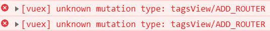

# Vue 开发常见错误

## 1 Vue错误
1. `TypeError: ctx.injections.tableRoot.$scopedSlots[ctx.props.column.slot] is not a function`
	- 对应的 slot没有写

2. `Do not use built-in or reserved HTML elements as component id: Text`
	- 模板需要插入到 DOM 中，所以模板中的标签名必须能够被 DOM 正确地解析。主要有三种情况：
  	* 不合法的标签名，例如 </>;
  	* 与 HTML元素重名会产生不确定的行为，例如使用 input 做组件名不会解析到自定义组件，使用 button 在 Chrome 上正常但在 IE 上不正常
  	* 与 Vue 保留的 slot、partial、component 重名，因为会优先以本身的意义解析，从而产生非预期的结果。
	* 组件名（name:''）不能和 html标签重复

3. `[Vue warn]: Invalid prop: type check failed for prop "value". Expected String, Number, got Undefined`
	- 初始化的时候没有数据
	- 加上if 判断，有没有这个数据，一般都是对象或数组，ajax获取数据之前报错
  - `v-if="Object.keys(material).length"`


## 2 vuRouter错误

1. `[vue-router] Duplicate named routes definition: { name: "form", path: "/form" }`
	- `vue-router name 重复`


2. `Cannot find module \'vue-loader/lib/plugin\`


3. `You are using the runtime-only build of Vue where the template compiler is not available. Either pre-compile the templates into render functions, or use the compiler-included build`


4. `Warning: name can no longer contain capital letters`
	* 项目名称不能包含大写字母
	* package.json / name 不能有英文大写字母


5. `iview Select` 选择框选中内容后有空格的问题
	- Option组件格式化造成的。</Option> 换行，
	- 只要和输出内容一行，就不会有空格了
	- textarea 也有这个问题


6. `[Vue warn]: Missing required prop: "value"`
	- 缺少必传的 value，value属性没有被定义

```
	<i-option
	  v-for="(val,key) in material"
	  :key="key"
	  :value="material.id">
	  {{val}}
	</i-option>
```


## 3 Vuex错误

1. unknow mutation type




2. `Computed property "XXX" was assigned to but it has no setter`

```
报错原因：
	组件中v-model=“XXX”，而XXX是vuex state中的某个变量
	vuex中是单项流，v-model是vue中的双向绑定，
	但是在 computed中只通过 get获取参数值，没有 set无法改变参数值

解决方法：
	将v-model改成 :value

	computed中添加 get和 set

	computed: {
		// 只有 get, 没有 set，用 v-model报错
		...mapState({
			name: state => state.name,
		}),

		// computed中添加 get 和 set
		getName: {
			get() {
				return this.$store.state.name
			},
			set(val) {
				this.$store.state.name = val
			}
		}
	}

````


2. `Do not use built-in or reserved HTML elements as component id: html`

```
1. 组件名字不能和html标签重复，在 component里面注册组件的时候，
	避免用html已有的标签来接收组件；

2. vue里面不允许用特殊的标签来做自定义的标签，比如你不能用a来接收一个组件的注册，
	然后在以自定义标签的方式引用会被限制

3. Vue 保留的 slot、partial、template 重名，
	因为会优先以本身的意义解析，从而产生非预期的结果

4. Vue 组件的名称最好不要和原生 HTML 标签相同。
	为了避免重名，通常会在组件名称前面加上一个前缀，如
	el-button、el-input、el-date-picker

```


3. `filters 中 this undefined`
* 过滤器是一个纯函数，不应该依赖上下文
* 推荐使用 computed | method
* You can take `this` as a parameter for your filter function.

```
This is intentional in 2.x. Filters should be pure functions and should not be dependent on this context.
If you need this you should use a computed property or just a method e.g. $translate(foo)
https://github.com/vuejs/vue/issues/5998

```


## Vue 兼容性问题

1. `vscode` vue 红色波浪线
  1. vscode -> 首选项 -> 设置 -> 搜索 (vetur)，
  2. 将vetur.validation.template 设置为 false 就可以解决问题了


2. IE下白屏现象
  - 安装 `babel-polyfill` 依赖
  - main.js 引入 import "babel-polyfill";
  - 重新 npm run dev 一下，再在IE中访问项目，就可以正常浏览了


3. type类型 指明为: `text-ecmascript-6` 使用 es6 不报错
	`<script type="text-ecmascript-6"></script>`