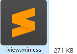

# iview-ui 使用总结

## 1 theme主题样式定制

1. 复制 iview 样式 styles目录到 `src/plugins`，styles 路径
	- `/node_modules/view-design/src/styles`
	- 替换 `normalize.css` 为最新版 `normalize.css v8.0.1`

2. 修改 `common/base.less` 去除不必要的代码
	- `common/index.less` 首行 `base` 替换为 `normallize`
	- 修改 normalize.less
	- 去除 `div, li, header,article, aside, nav, section`

3. 删除 `base.less` 把 `base.less` 的代码合并到 `normalize.less`
4. 精简 icon-font,
5. 用 gulp 重新编译打包 styles 样式文件
	- 精简后的 iview.css 271 kb，如果按需引入，体积会更小
	- 

## 2 tags-view

1. 判断路由的唯一
	- 简单的只需要判断 name值，如果 name存在，直接 splice 替换这个对象

2. 精确的需要判断 name, query, params 需要先把每个参数排序，然后转为 String做对比 