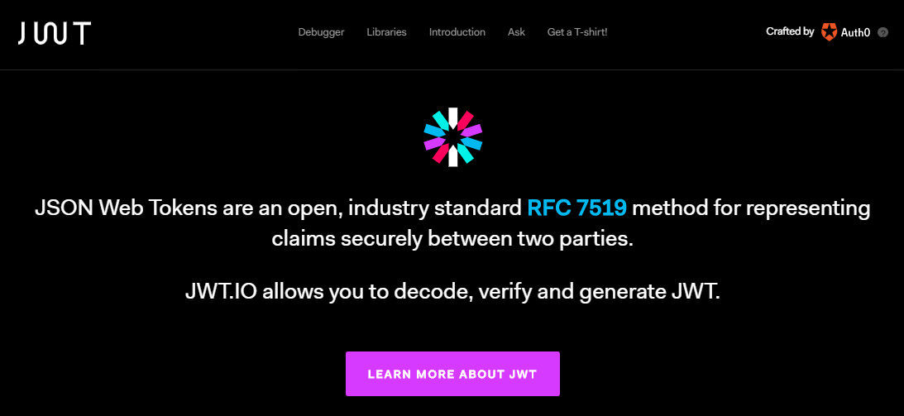
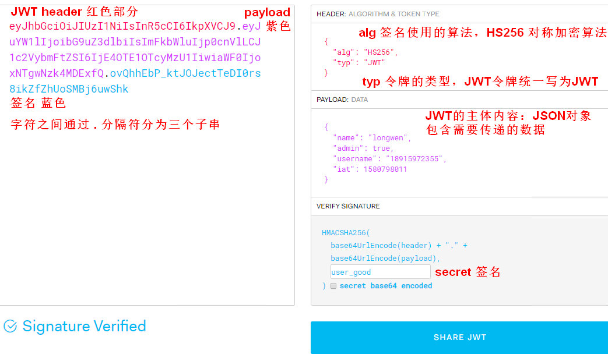

# JsonWebToken 跨域身份验证

1. 登录，退出及 token 处理
2. token 过期处理


## 一 什么是JWT

1. JSON Web Token（JWT）是目前最流行的跨域身份验证解决方案
  - Json表示令牌的原始值是一个Json格式的数据；
  - Web表示是在互联网传播的；
  - Token表示令牌，简称JWT
  - [JWT 官网](https://jwt.io/)



- **JWT解决问题**
  - session不支持分布式架构，无法支持横向扩展，只能通过数据库来保存会话数据实现共享；
  - 如果持久层失败会出现认证失败。
  - 优点：服务器不保存任何会话数据，即服务器变为无状态，使其更容易扩展。
  - JWT 根据token 包含的数据：确定用户是谁？有什么权限？然后是否要给用户提供资源。

- **JWT的最大缺点**
  1. 服务器不保存会话状态，在使用期间不可能取消令牌或更改令牌的权限。
    - 也就是说，一旦JWT签发，在有效期内将会一直有效

  2. JWT本身包含认证信息，一旦信息泄露，任何人都可以获得令牌的所有权限。
    - 为了减少盗用，JWT的有效期不宜设置太长。
    - 对于某些重要操作，用户在使用时应该每次都进行进行身份验证
    - 为了减少盗用和窃取，要使用加密的 HTTPS协议进行传输


### 2.1 JWT的组成
- JWT包含了使用 `.` 分隔的三部分
- ` {Header 头部}.{Payload 负载}.{Signature 签名} `

- 

#### header 头部 

```javascript
  { "alg": "HS256", "typ": "JWT"}   
  // algorithm => HMAC SHA256
  // type => JWT

```

#### payload 有效载荷

- payload JWT的主体内容，是一个JSON对象，包含需要传递的数据
- JWT 规定了7个官方字段

```js
  iss (issuer)：签发人
  exp (expiration time)：过期时间
  sub (subject)：主题
  aud (audience)：受众
  nbf (Not Before)：生效时间，在此之前不可用
  iat (Issued At)：签发时间，发布时间
  jti (JWT ID)：id 用于标识该JWT，签发token的时间

// 除以上默认字段外，我们还可以自定义私有字段
const payload = {
  name: 'longwen',
  admin: true,
  username: '18915972355'
}

```

#### signature 哈希签名

- 对前两部分的签名，防止数据篡改
  - 指定一个密码 secret；该密码仅仅为保存在服务器中，并且不能公开
  - 在计算出签名哈希后，JWT header头，payload 有效载荷和签名哈希的三个部分组合成一个字符串；
  - 每个部分用 "." 分隔，就构成整个JWT对象

- JWT 作为一个令牌（token），有些场合可能会放到 URL，比如：api.example.com/?token=xxx
  - Base64 有三个字符`+`、`/`和`=`，在 URL 里面有特殊含义，
  - 所以要被替换掉：`=`被省略、`+`替换成`-`，`/`替换成`_`；这就是 Base64URL 算法

- 签名算法：默认 HS256，对称算法：加密解密用同一个密码
  - RS256 非对称算法，签名的时候用私钥，验证的时候要用到一个对应的公钥

```javascript
HMACSHA256(
  base64UrlEncode(header) + "." +
  base64UrlEncode(payload),
  secret)

```


### 2.2 jsonwebtoken

```js
const jwt = require('jsonwebtoken')

// payload 实际的数据
const payload = {
  name: 'longwen',
  admin: true,
  username: '18915972355'
}

// 秘钥签名，随机的字符
// 默认 HS256 对称加密算法，签名和验证用同一个密码
const secret = 'user_longwen'

// 1 签发 token
const token = jwt.sign(payload, secret)
console.log(token)

// 2 签发后验证 token, secret不对，验证失败
jwt.verify(token, secret, (err, decoded) => {
  if (err) {
    console.log(err.message)
    return
  }
  // 验证成功
  console.log('decoded token', decoded)
})

// 验证token 
node jwt.js

```

#### jwt options 选项

```js
var options_for_objects = [
  'expiresIn',
  'notBefore',
  'noTimestamp',
  'audience',
  'issuer',
  'subject',
  'jwtid',
]
```


#### openssl 生成私钥和公钥

```bash
# openssl 生成私钥
openssl genrsa -out rsa_private_key.pem 1024

# 根据私钥生成公钥
openssl rsa -in rsa_private_key.pem -pubout -out rsa_public_key.pem


# ssh-keygen 生成 key
# 2048 指定位数；private.key 输出的名字
ssh-keygen -t rsa -b 2048 -f private.key

```


## 3. 使用JWT

- 客户端接收服务器返回的JWT，将其存储在Cookie或localStorage中
  - 以后每次访问，客户端将在与服务器交互中都会带JWT
  - 一般是将 JWT 放入HTTP请求的Header Authorization字段中。

1. HTTP 请求的头信息 `Authorization` 字段里面
  - ` Authorization: Bearer <token> `
  - axios 请求拦截里设置 token
  ```js
    axios.interceptors.request.use(config => {
      config.headers.Authorization = `Bearer ${localStorage.getItem('token')}`
    })
  ```

2. 通过url传输
  -  get 请求：` http://www.xxx.com/pwa?token=xxxxx `
  - 如果是 post请求也可以放在请求体中


### 1. 服务器返回 TOKEN

```javascript
let express = require('express')
let app = express()
let bodyParser = require('body-parser')
let jwt = require('jsonwebtoken')

app.use((req,res,next) => {
  res.header("Access-Control-Allow-Origin", "http://localhost:8080");
  res.header("Access-Control-Allow-Methods", "GET,HEAD,OPTIONS,POST,PUT");
  res.header("Access-Control-Allow-Headers", "Origin, X-Requested-With, Content-Type, Accept, Authorization");
  if(req.method.toLowerCase() === 'options'){
    return res.end()
  }
  next()
})

app.use(bodyParser.json())

// 加密的字符串
let secret = 'lulongwen'

app.get('/test',(req,res)=>{
  res.end({test:'test'})
})

app.post('/login',(req,res)=>{
  let {username} = req.body;
  if (username === 'admin') { // 如果访问的是admin 种植cookie
    return res.json({
      code:0,
      username:'admin',
      token:jwt.sign({username:'admin'},secret,{
        expiresIn: 20  
      })
    })
  }

  res.json({
    code:1, data:'用户名不存在'
  })
})

app.get('/validate',(req,res) => {
  let token = req.headers.authorization
  // 验证token的可靠性
  jwt.verify(token,secret,(err,decode)=> {
    if (err) return res.json({
      code:1,
      data:'token失效了'
    })

    res.json({ 
      username:decode.username,
      code:0, // 延长tokne的过期时间
      token:jwt.sign({username:'admin'},secret,{
        expiresIn:20 // 20秒过期
      })
    })

  })
})

app.listen(3000)

```


### 2. JWT 路由配置

- Home.vue     首页
- Profile.vue  个人中心
- Login.vue    登录页面

```javascript
export default new Router({
  mode: 'history',
  base: process.env.BASE_URL,
  routes: [
    {
      path: '/',
      name: 'home',
      component: Home,
    },
    {
      path: '/profile',
      name: 'profile',
      component: Profile,
      meta: { isLogin: true } // 必须要登录才能访问
    },
    {
      path: '/login',
      name: 'login',
      component: Login,
    }
  ]
})

```


## 4. axios封装

```javascript
import axios from 'axios'

class Ajax {
  constructor() {
    this.baseURL = process.env.NODE_ENV === 'development' ? 'http://localhost:3000' : '/'; // 请求路径 
    this.timeout = 3000; // 设置超时时间
  }

  setInterceptor(instance) { // 设置拦截器
    instance.interceptors.request.use(config => {
      config.headers.Authorization = `${localStorage.getItem('token')}`
      return config; // 增加token
    }, (err) => {
      Promise.reject(err);
    });

    instance.interceptors.response.use(res => res.data, (err) => {
      Promise.reject(err);
    });
  }

  request(request) {
    const instance = axios.create();
    const config = {
      baseURL: this.baseURL,
      timeout: this.timeout,
      ...request,
    }; // 合并配置
    this.setInterceptor(instance);
    return instance(config);
  }
}

export default new Ajax()

```


## 5. 测试接口

```javascript
export const getTest = () => fetchData.request({ url: '/test' })

export const login = username => fetchData.request({
  url: '/login',
  method: 'POST',
  data: {
    username
  }
})

export const validate = () => fetchData.request({ url: '/validate' })

```


## 6. 在vuex中发送请求
```javascript
export default new Vuex.Store({
  state: {
    username: '',
  },
  mutations: {
    setUsername(state, username) {
      state.username = username;
    }
  },
  actions: {
    async login({ commit }, username) {
      const r = await login(username) // 登录成功后返回用户名信息
      if (r.token) { // 如果有返回token说明成功
        commit('setUsername', username) // 将用户存入state中
        localStorage.setItem('token', r.token) // 将token存放起来
      } else { // 否则返回失败的promise
        return Promise.reject(r)
      }
    }
  }
})

```


## 7. 权限认证

```javascript
async validate({ commit }) {
  const r = await validate()
  if (r.code === 1) return false

  commit('setUsername', r.username);
  localStorage.setItem('token', r.token) // 将token存放起来
  return true
}

```

1. 判断用户访问权限

```javascript
router.beforeEach(async (to, from, next) => {
  // 如果不需要校验可以设置白名单
  const isLogin = await store.dispatch('validate');
  if (isLogin) {
    // 如果是登录
    if (to.name === 'login') {
      next('/profile')
    } else {
      next()
    }
  } else {
    const flag = to.matched.some(item => item.meta.needLogin);
    if (flag) {
      next('/login')
    } else {
      next()
    }
  }
})

```


## 8 后端返回路由鉴权思路

1. 本地放置一份完整的菜单路由，通过后台返回的 角色JSON数据
  - 对比2个数组，筛选出后台返回的菜单的 **JSON 动态路由**

2. 在 router.js里面，利用 `router.addRouter()` 实现动态添加路由实现

3. 面包屑导航响应原理
  - 通过 `this.$route.match` 获取捕获的路由参数 
  - 然后遍历这个路由，获取路由信息，添加当前路由和子路由


### router.addRouter() 实现思路
1.初始化路由，只有路由白名单，例如 `['login', 403, 404, 500]` 等不需要权限就可以访问
2. 登录时，输入用户名和密码，请求后台，得到菜单的 **JSON数据**
3. 后台返回的路由是 String，例如：`{"component":"server.appointment"}`，要处理后台返回的路由数据
  - 把后台路由的 components 字符串转化成组件
  - 存进 sessionStorage防止刷新页面时丢失

4. 调用 router.addRouter(routes)动态添加路由

https://router.vuejs.org/zh/api/#router-currentroute
http://www.mamicode.com/info-detail-2328036.html
https://blog.csdn.net/u010047432/article/details/88982369
https://blog.csdn.net/sweet_note/article/details/81073564
https://blog.csdn.net/qq_34160246/article/details/80322036
https://www.cnblogs.com/lizhao123/p/10308985.html
