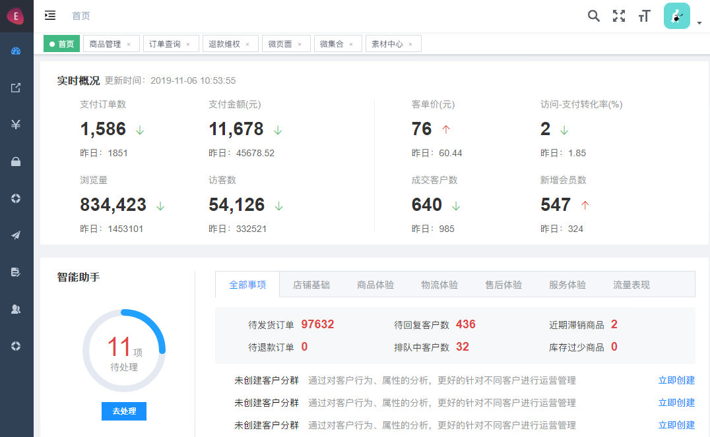

# Vue 参考资料

* [Vue CLI](https://cli.vuejs.org/zh/guide/)
* [svelte 前端框架](https://svelte.dev/docs#svelte_self)


## Web UI

* [Element UI](https://github.com/ElemeFE/element)
* [Antd Vue](https://www.antdv.com/docs/vue/faq-cn/)
* [Material Vue](https://github.com/vuetifyjs/vuetify)


## App UI

* [Nut UI](http://nutui.jd.com/#/intro)
* [Cube UI](https://didi.github.io/cube-ui/#/zh-CN/docs/tab-bar)
* [Mint UI](http://mint-ui.github.io/docs/#/zh-cn2)
* [mpvue 小程序](http://mpvue.com/)


## vue-admin 参考

1. **avue: element-ui 二次封装**
	- [www.evue.top 首页](http://www.evue.top/)
	- [admin.evue.top 后台](http://admin.evue.top/#/dashboard)
	- 


## Vue 开发技巧

* [Vue 源码分析](https://ustbhuangyi.github.io/vue-analysis/)
* [Vue 源码分析 Github](https://github.com/ustbhuangyi/vue-analysis)
* [Vue2.1.7 源码](http://hcysun.me/2017/03/03/Vue%E6%BA%90%E7%A0%81%E5%AD%A6%E4%B9%A0/)
* [实现 mvvm](https://github.com/DMQ/mvvm)

* [滴滴 webapp 5.0 重构经验](https://github.com/DDFE/DDFE-blog/issues/13)
* [Vue SEO](https://segmentfault.com/a/1190000011072893)

* [Element 开发分享](https://www.cnblogs.com/woodk/p/6048890.html)
* [Element Table组件分析](https://www.jianshu.com/p/91ae0724f5f3)
* [表单验证](https://github.com/yiminghe/async-validator)
* [后台登录验证](https://www.cnblogs.com/herozhou/p/7469667.html)

* [Vue 最佳实践](https://segmentfault.com/a/1190000014085613)
* [Vue 全家桶笔记](https://blog.csdn.net/u012860063/article/details/68063919)
* [嵌套组件 - slot 笔记](https://www.cnblogs.com/xxcanghai/p/6098663.html)
* [cumputed - watch 笔记](https://www.jianshu.com/p/709a7bd05da4)
* [v- 指令](https://www.jianshu.com/p/7409bee595a5)

* [iview-admin IE兼容](https://my.oschina.net/u/2324376/blog/1612225)
* [上线字体图表问题](https://github.com/iview/iview/issues/515)
* [上线单页应用刷新出现404](https://study.miaov.com/bbs/55716)

* [Vue2.0 废弃的 API](https://github.com/vuejs/vue/issues/2873)


## Vue 项目参考

* 
* https://chenyubo.me/vue-eleme-app/dist/index.html#/
* http://ustbhuangyi.com/sell/#/goods

* [Vue 音乐播放器](https://github.com/August-Z/vue-chicken-music)
* [Vue 仿饿了么APP](https://github.com/cccyb/vue-eleme-app)
* [Vue 仿微信](https://github.com/useryangtao/vue-wechat)

* [移动端框架选择](https://ask.dcloud.net.cn/article/36083)
* [awesome-vue](https://github.com/vuejs/awesome-vue)
* [Quill 编辑器](https://github.com/surmon-china/vue-quill-editor)

* [滴滴 WebApp 架构团队](https://github.com/DDFE/DDFE-blog/blob/master/JD.md)
* [前端开发工程师](http://nutui.jd.com/#/joinus)


```
权限控制
  https://www.cnblogs.com/zhengrunlin/p/8981017.html


* iview视频
  https://segmentfault.com/ls/1650000016424063

* vue 骨架屏
  https://segmentfault.com/a/1190000014832185

* 后台做动态表单绘制，就是用拖拽的方式来动态创建表单
  https://github.com/SortableJS/Vue.Draggable

* vue-antd
  https://github.com/vueComponent/ant-design-vue

* vue指令
  https://github.com/vueComponent/vue-ref


Vue总结
  https://cn.vuejs.org/v2/cookbook


前端技术总结
  https://github.com/chenqf

算法
  https://github.com/chenqf/technical-summary

扁平化数组
  https://www.cnblogs.com/wind-lanyan/p/9044130.html

vue 打印
  http://blog.kwin.wang/programming/vue-table-export-excel-and-print.html

lodop 打印
  https://juejin.im/post/5d1ea65bf265da1b6c5f9482

接车单，采购单，销售单，每天都从 01开始

Vue 组件库和 案例
https://juejin.im/post/5af16a2cf265da0b8636353b#heading-7

30个 Vue面试题
  https://juejin.im/post/5d59f2a451882549be53b170

Vue最佳实践
  https://juejin.im/post/5d48f3b7e51d4561e224a2c8

MVVM和虚拟DOM
  https://juejin.im/post/5d41eec26fb9a06ae439d29f

Vue性能优化
  https://juejin.im/post/5d548b83f265da03ab42471d

Vue主题切换
	https://blog.yux.team/2019/08/15/20190815/

Vue markdown
	https://github.com/ovenslove/vue-mdEditor

Vue 仿饿了么
	https://github.com/bailicangdu/node-elm

heyUI
	https://www.heyui.top/

heyUI admin 中后端系统
	https://admin.heyui.top/

Vue 知识点总结
  https://juejin.im/post/5cb8811be51d456e46603e21


用 npm script 打造超溜的前端工作流
  https://juejin.im/book/5a1212bc51882531ea64df07
  https://www.kancloud.cn/sllyli/npm-script/1243451

Vue 项目构建与开发入门
  https://juejin.im/book/5b23a5aef265da59716fda09
  https://blog.csdn.net/guozhangqiang/category_8667319.html
  https://blog.csdn.net/guozhangqiang/article/details/87197558
  https://zhuanlan.zhihu.com/p/27571881
```

[聊聊 Vue.js 的 template 编译](https://juejin.im/post/59da1c116fb9a00a4a4cf6dd)

[new Function](https://developer.mozilla.org/zh-CN/docs/Web/JavaScript/Reference/Global_Objects/Function)

[深拷贝和浅拷贝](https://juejin.im/post/5b5dcf8351882519790c9a2e)

[Div和Table渲染的区别](https://www.cnblogs.com/lovebear/archive/2012/04/18/2456081.html)

Vue技巧总结 https://segmentfault.com/a/1190000019086657

ES module http://es6.ruanyifeng.com/#docs/module