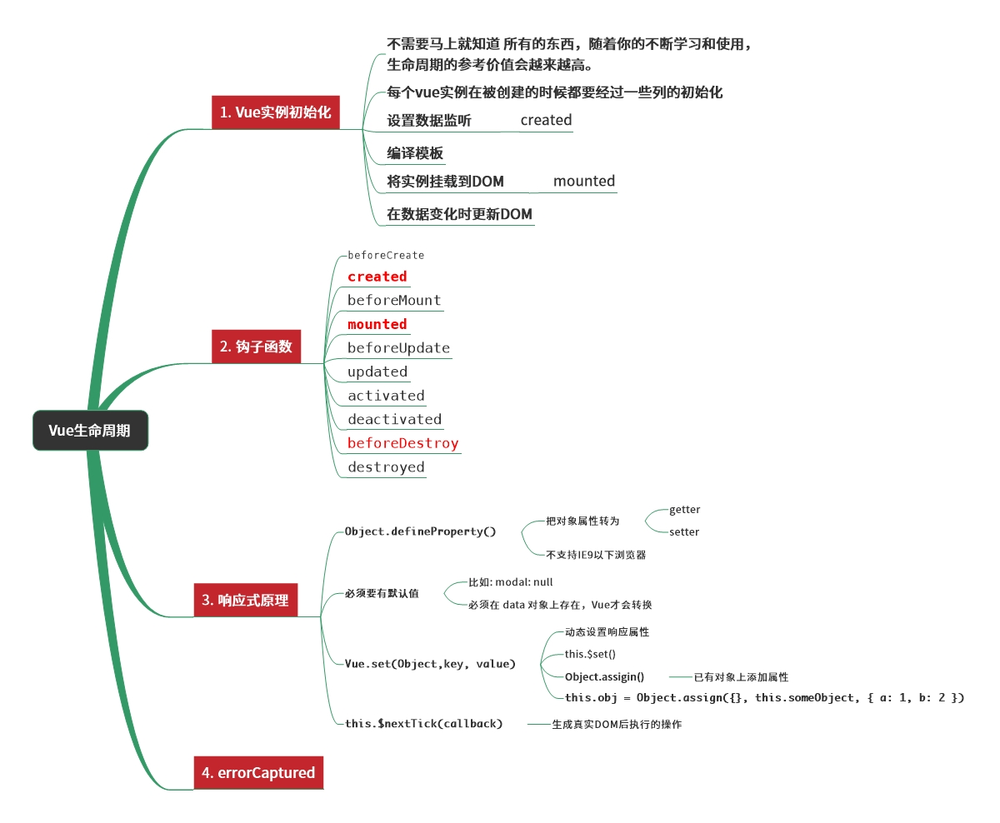

# Vue生命周期

1. Vue有哪些生命周期方法
2. Vue生命周期方法的调用顺序
3. 生命周期中 Vue实例有哪些区别
4. 渲染DOM `render函数 > template > #app`


1. 创建前/后
  - beforeCreate, create
  - beforeCreate 阶段，Vue实例的挂载元素 el 和数据对象 data都为 undefined，还未初始化
  - created 阶段，Vue实例的数据对象 data 有了，el 还没有

2. 载入前/后
  - beforeMount, mounted
  - beforeMount 阶段，Vue实例的 $el 和 data 都初始化了，但还是挂载之前为虚拟的 DOM节点，data 尚未替换
  - mounted 阶段，Vue 实例挂载完成，data 成功渲染

3. 更新前/后
  - beforeUpdate, update
  - data 变化时，会触发 beforeUpdate 和 updated 方法
  - update 不能修改 data里面的数据，会死循环

4. 销毁前/后
  - beforeDestroy, destroyed
  - beforeDestroy 在 Vue 实例销毁前触发，一般在这里 removeEventListener解除手动绑定的事件
  - destroyed 实例销毁后，触发 destroyed

5. [Vue 生命周期参考资料](https://cn.vuejs.org/v2/api/#%E9%80%89%E9%A1%B9-%E7%94%9F%E5%91%BD%E5%91%A8%E6%9C%9F%E9%92%A9%E5%AD%90)

```js
export default {
  name: 'Card',
  beforeRouteEnter(to, from, next) {
    next(vm => {
      // beforeRouteEnter 通过 vm访问组件实例，这个阶段没有 this
      vm.init() // vm 是当前组件的实例，代替 this
    })
  },
  beforeRouteLeave(to, from, next) {
    this.$destroy() // 可以访问组件的实例 this
    next()
  },

  beforeRouteUpdate(to, from, next) {
    // 可以访问组件的实例 this
  },

  mounted() {

  },
  created() {

  },

  methods: {
    // 路由跳转
    this.$router.push({name: 'index', params: {}, query: {}})
  }
}

```

## 1 组件生命周期

```js
export default {
  name: 'LifeCircle',
  mixins: [],
  beforeRouteEnter(to, from, next) {
    next(vm =>{
      // 不能获取 组件实例 this,因为当守卫执行前，组件实例还没有被创建
      // 通过 vm 访问组件实例 vm.init()
    })
  },
  beforeRouteUpdate(to,from, next) {
    // 路由改变前，该组件被复用时调用，比如动态路由参数 /a/:id, 路由 /a/2 跳转/a/3
    // 由于渲染同样的组件，组件实例会被复用，在 beforeRouteUpdate进行数据更新
    // 可以访问 this实例
    this.init(to.query.id)
    next()
  },
  
  beforeRouteLeave(to, from, next) {
    this.$destroy()
    next()
  },
  
  mounted() {
    // DOM渲染完成，可以获取 DOM
  },
  created() {
    // 页面初始化
  },
  
  // keep-alive 组件下，页面离开和进入
  activeted() {
    // 页面显示
    window.addEventListener('scroll', this.fnScroll);
  },
  deactiveted() {
    // 页面即将被替换成新的页面时，触发
    window.removeEventListener('scroll', this.fnScroll)
  },
  
  methods:{
    fnScroll(ev) {
      console.log('ev', ev)
    }
  }
}
```


## 2 数组类型

1. 生命周期钩子可以是一个数组类型，且数组中的函数会依次执行

```js
created: [
  function one () {
    console.log(1)
  },
  function two () {
    console.log(2)
  }
]
```





## 3 生命周期执行不同的操作

1. vue实例选项- 生命周期钩子函数
  - 特定的实例对象生命周期里执行不同的操作

```js
  beforeCreate // 实例初始化之后

  created // 实例创建完成之后被调用

  beforeMount // 在挂载元素之前被调用

  mounted // el被新创建的 vm.$el 替换，挂载到实例上
    // HTML渲染完成后

  beforeUpdate // 数据更新时被调用

  updated // 数据更新后调用

  activated

  deactivated

  beforeDestroy // 实例销毁之前调用，可以获取到 this

  destroyed // 实例销毁之后调用

  errorCaptured // 错误捕获
```